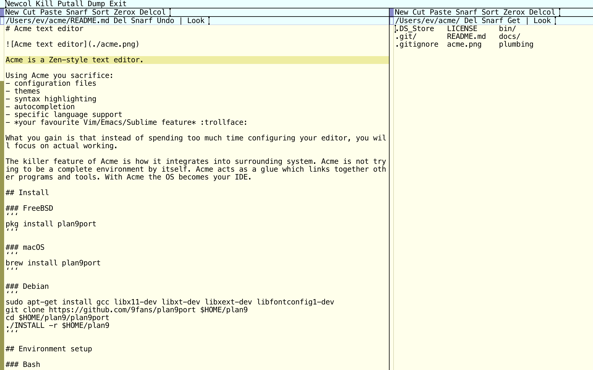

# Acme text editor



Acme is a Zen-style text editor.

Using Acme you sacrifice:
- configuration files
- themes
- syntax highlighting
- autocompletion
- specific language support
- *your favourite Vim/Emacs/Sublime feature* :trollface:

What you gain is that instead of spending too much time configuring your editor, you will focus on actual working.

The killer feature of Acme is how it integrates into surrounding system. Acme is not trying to be a complete environment by itself. Acme acts as a glue which links together other programs and tools. With Acme the OS becomes your IDE.

## Install

### FreeBSD
```
pkg install plan9port
```

### macOS
```
brew install plan9port
```

### Debian
```
sudo apt-get install gcc libx11-dev libxt-dev libxext-dev libfontconfig1-dev
git clone https://github.com/9fans/plan9port $HOME/plan9
cd $HOME/plan9/plan9port
./INSTALL -r $HOME/plan9
```

## Environment setup 

### Bash
```
export PLAN9="/path/to/plan9port"
export PATH="$PATH:$PLAN9/bin"
```

### Tcsh
```
setenv PLAN9 /path/to/plan9port
set path = ($path $PLAN9/bin)
```

## Font

Run font server:
```
fontsrv
```

In case it's not installed:
```
cd /path/to/plan9port/src/cmd/fontsrv/
9 mk install
```

Have a look at all available fonts:
```
9p ls font
```

Try one of them:
```
acme -f /mnt/font/'Droid Sans Mono'/13a/font
```

## Run

I spawn Acme by running `a` script.

## Scripts

Who is who in **bin** directory:

- `a` start Acme
- `ag+` search with The Silver Searcher
- `c+ SYMBOL` comment selection (python: `|c+` or `|c+ '#'`, erlang: `|c+ %`, js: `|c+ //`)
- `c- SYMBOL` uncomment selection
- `git+ MESSAGE` git: commit and push to master
- `h+` heading
- `hg+ MESSAGE` hg: commit and push to master
- `lc+` to lowercase
- `nobs+` taken from plan9 `nobs` (it removes all backspace characters and the characters that precede them)
- `s-` remove leading whitespace
- `s2t N_SPACES` spaces to tabs (default: 4 spaces to 1 tab)
- `t2s N_SPACES` tabs to spaces (default: 1 tab to 4 spaces)
- `t+` add tab
- `t-` delete tab
- `uc+` to uppercase

Put these guys in your **$PATH**.

## Random notes

- `Edit =` find out the current line number 
- `:13` goto 13th line
- `:0` goto file beginning
- `:$` goto file end
- `:0,$` or `:,` or `Edit ,` select the whole file
- `:1,5` select lines 1..5
- `Edit , d` clear window
- `Edit , < echo hello world` replace window body with some text
- `Edit , < erl -man maps` replace window body with erlang manual
- `Edit , s/text/TEXT/g` or `Edit , | sed 's/text/TEXT/g'` global replace
- `$%` or `$samfile` current file name
- `$winid` current window id
- `echo some text | 9p write acme/$winid/body` append to the end of current window
- keyboard shortcuts:
  - `ctrl-u` delete from cursor to start of line
  - `ctrl-w` delete word before the cursor
  - `ctrl-h` delete character before the cursor
  - `ctrl-a` move cursor to start of the line
  - `ctrl-e` move cursor to end of the line
  - `ctrl-i` tab
  - `ctrl-j` enter
  - `ctrl-f` filepath autocompletion
  - `fn-*left arrow*` go home (macOS)
  - `fn-*right arrow*` go end (macOS) 
- `:foobar` search forward
- `:-/foobar` search backwards
- press `esc` to select the last typed text
- press `esc` again to delete any selected text
- `Font` switch between fonts
- `:/^hel` regexp match: lines starting with 'hel'
- `:/lo\n/` regexp match: lines ending with 'lo' 
- `:/^b/,/^e/` regexp match: lines between starting with 'b' and starting with 'e'
- `Dump` write the state of acme to the file
- `Load` restore from the dump
- `Edit , > python` pipe window body through python interpreter
- three-finger tap emulates middle click (macOS) 

## Sam commands

- `Edit +/hello/` search 'hello' forward
- `Edit -/hello/` search 'hello' backward
- `Edit , > wc -l` count lines in file
- `Edit , | sort` sort lines
- `Edit 3,5p` print lines 3..5 in new window
- `Edit 3,5 |uc+` lines 3..5 upper cased
- `Edit 3,5 s/HE/he/g` replace on 3..5 lines only 
- `Edit 2 d` delete second line
- `Edit 2 a/new\n/` append text after 2nd line
- `Edit 2 i/new\n/` insert text before 2nd line

## Cut / Copy selection to a file

- select some text
- cut:  `| sed '' > file.txt`
- copy: `> sed '' > file.txt`
- pipe selection to a file: `> awk '{ print(toupper($1)) }' | sort | nl > file.txt`

## Games!

- [Tic-tac-toe](https://github.com/evbogdanov/acme_tic_tac_toe)

## Other Plan9 goodies

- `win` start shell in a new window
- `page FILE` view graphics files
- `web URL` open url in your browser

## Resources

- [Acme homepage](http://acme.cat-v.org/)
- [A Tour of the Acme Editor](http://www.youtube.com/watch?v=dP1xVpMPn8M)
- [Plan 9 Acme Intro](http://www.youtube.com/watch?v=dopu3ZtdCsg)
- [On using Acme as a day-to-day text editor](http://jlouisramblings.blogspot.ru/2013/04/acme-as-editor_20.html)
- [Let’s Try Acme](http://echosa.github.io/blog/categories/acme/)
- [Plan 9 configuration](https://github.com/jlouis/plan9-setup)
- [Extensibility in the Acme text editor](http://www.mostlymaths.net/2013/03/extensibility-programming-acme-text-editor.html)
- [Plan 9 from User Space](https://github.com/9fans/plan9port)
- [Community: 9fans](http://plan9.bell-labs.com/wiki/plan9/9fans/index.html)
- [Google group: plan9port-dev](https://groups.google.com/forum/#forum/plan9port-dev)
- [Plan 9 and FreeBSD](https://forums.freebsd.org/threads/rio.29736/)
